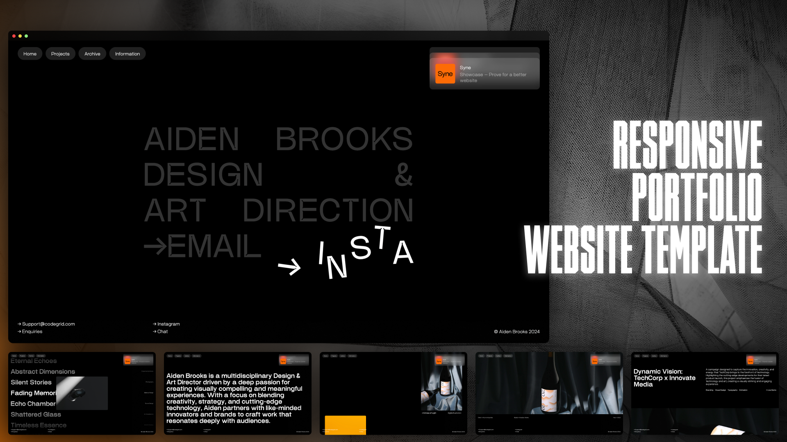

# Website Template 11



## 🌟 Overview

Website Template 11 is a modern, elegant portfolio template featuring Aiden Brooks, a designer and art director. This template showcases a minimalist design approach with smooth animations, interactive elements, and a sophisticated user interface.

## ✨ Features

- **Modern Design**: Clean, minimalist layout with elegant typography
- **Smooth Animations**: Text animations with dynamic letter effects
- **Interactive Navigation**: Sleek navbar with expandable article sections
- **Responsive Layout**: Fully responsive design that works on all devices
- **React-based**: Built with React.js for optimal performance
- **React Router**: Seamless navigation between pages
- **Custom Transitions**: Smooth page transitions for enhanced UX

## 🚀 Demo

🔗 **Live Preview**: [https://website-template-11-30lc6xane-alexey9911s-projects.vercel.app](https://website-template-11-30lc6xane-alexey9911s-projects.vercel.app)

## 🛠️ Technologies Used

- **React.js** - Frontend framework
- **React Router DOM** - Client-side routing
- **CSS3** - Custom styling and animations
- **Vite** - Build tool and development server
- **Vercel** - Deployment platform

## 📂 Project Structure

```
website-template-11/
├── public/
│   ├── image.png          # Banner image
│   └── site-icon.png      # Favicon
├── src/
│   ├── components/
│   │   ├── footer/        # Footer component
│   │   ├── navbar/        # Navigation component
│   │   └── transition/    # Page transition component
│   ├── pages/
│   │   ├── home/          # Home page
│   │   ├── projects/      # Projects page
│   │   ├── archive/       # Archive page
│   │   └── information/   # Information page
│   ├── assets/            # Images and static assets
│   └── main.jsx          # App entry point
├── index.html
└── package.json
```

## 🎨 Design Features

- **Typography**: Modern font stack with animated text effects
- **Color Scheme**: Elegant dark theme with accent colors
- **Layout**: Grid-based responsive design
- **Animations**: Custom CSS animations for enhanced user experience
- **Interactive Elements**: Hover effects and dynamic content

## 🚀 Quick Start

### Prerequisites

- Node.js (version 14 or higher)
- npm or yarn package manager

### Installation

1. **Clone the repository**
   ```bash
   git clone https://github.com/Alexey9911/website-template-11.git
   cd website-template-11
   ```

2. **Install dependencies**
   ```bash
   npm install
   # or
   yarn install
   ```

3. **Start development server**
   ```bash
   npm run dev
   # or
   yarn dev
   ```

4. **Open your browser**
   Navigate to `http://localhost:3000` to see the template in action.

### Build for Production

```bash
npm run build
# or
yarn build
```

## 📄 Pages

- **Home**: Hero section with animated text and call-to-action links
- **Projects**: Showcase of work and projects
- **Archive**: Collection of past work and achievements
- **Information**: About section and contact details

## 🔧 Customization

### Changing Content

1. **Hero Section**: Edit `src/pages/home/Home.jsx` to update the main title and links
2. **Navigation**: Modify `src/components/navbar/Navbar.jsx` to change menu items
3. **Footer**: Update `src/components/footer/Footer.jsx` for contact information
4. **Styling**: Customize CSS files in respective component folders

### Adding New Pages

1. Create a new component in `src/pages/`
2. Add routing in `src/App.jsx`
3. Update navigation links if needed

## 📱 Responsive Design

The template is fully responsive and optimized for:
- **Desktop**: Full-featured layout with all animations
- **Tablet**: Adapted layout with touch-friendly interactions
- **Mobile**: Simplified layout optimized for small screens

## 🌐 Browser Support

- Chrome (latest)
- Firefox (latest)
- Safari (latest)
- Edge (latest)

## 📝 License

This project is open source and available under the [MIT License](LICENSE).

## 👨‍💻 Author

**Alexey**
- GitHub: [@Alexey9911](https://github.com/Alexey9911)

## 🤝 Contributing

Contributions, issues, and feature requests are welcome! Feel free to check the [issues page](https://github.com/Alexey9911/website-template-11/issues).

## ⭐ Show Your Support

If you like this template, please give it a ⭐ on GitHub!

---

**Made with ❤️ for the developer community**
